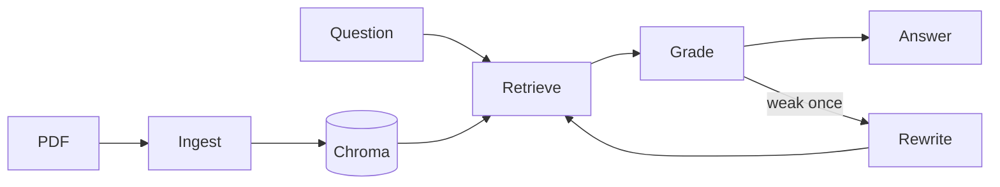

# Smart Document RAG

A local agentic PDF assistant that answers questions with page-cited evidence.

## Highlights

- One active PDF at a time.
- Local embeddings, retrieval, and generation with Ollama.
- Persistent Chroma vector index.
- Bounded LangGraph workflow with one query rewrite.
- Explicit insufficient-evidence responses.
- Extractive answers with grounded page citations.

## Architecture



## Quick start

Requirements: Python 3.11+ and Ollama.

```bash
python3 -m venv .venv
source .venv/bin/activate
pip install -r requirements.txt
ollama pull llama3.2
ollama pull nomic-embed-text
ollama serve
streamlit run app.py
```

Upload a PDF, index it, and ask a question.

## Configuration

Optional environment variables:

- `OLLAMA_BASE_URL`
- `OLLAMA_LLM_MODEL`
- `OLLAMA_EMBED_MODEL`
- `OLLAMA_CONTEXT_WINDOW`
- `SDA_DATA_DIR`

The default models are `llama3.2` and `nomic-embed-text`.

### Optional LangSmith tracing

Tracing is opt-in and remains inert when `LANGSMITH_TRACING` is not enabled or
`LANGSMITH_API_KEY` is absent. When enabled, the LangSmith SDK traces PDF text
extraction/chunking, retrieval, and every LangGraph step (analysis, grading,
optional rewrite, and answer generation), including textual prompts and outputs.
PDF binary bytes and API keys are never sent as trace data.

To configure it locally, copy `.env.example` to `.env` and replace only the
placeholder value with your key (never commit `.env`):

```bash
cp .env.example .env
# edit .env and set LANGSMITH_API_KEY to the key from LangSmith
```

The app loads this project `.env` at startup without overriding variables already
exported in the environment. Required tracing variables are:

- `LANGSMITH_TRACING=true`
- `LANGSMITH_API_KEY=...`
- `LANGSMITH_PROJECT=smart-document-rag` (optional project name)
- `LANGSMITH_ENDPOINT=https://api.smith.langchain.com` (optional)

Without these settings, local Ollama/RAG behavior is unchanged.

## Scope

This is a local MVP for one PDF at a time.

It does not provide authentication, cloud storage, multi-document search, or OCR.
