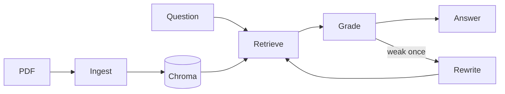

# Smart Document RAG

A local agentic PDF assistant that answers questions with page-cited evidence.

## Highlights

- One active PDF at a time.
- Local embeddings, retrieval, and generation with Ollama.
- Persistent Chroma vector index.
- Bounded LangGraph workflow with one query rewrite.
- Explicit insufficient-evidence responses.
- Extractive answers with grounded page citations.

## Architecture



## Quick start

Requirements: Python 3.11+ and Ollama.

```bash
python3 -m venv .venv
source .venv/bin/activate
pip install -r requirements.txt
ollama pull llama3.2
ollama pull nomic-embed-text
ollama serve
streamlit run app.py
```

Upload a PDF, index it, and ask a question.

## Configuration

Optional environment variables:

- `OLLAMA_BASE_URL`
- `OLLAMA_LLM_MODEL`
- `OLLAMA_EMBED_MODEL`
- `OLLAMA_CONTEXT_WINDOW`
- `SDA_DATA_DIR`

The default models are `llama3.2` and `nomic-embed-text`.

## Scope

This is a local MVP for one PDF at a time.

It does not provide authentication, cloud storage, multi-document search, or OCR.
